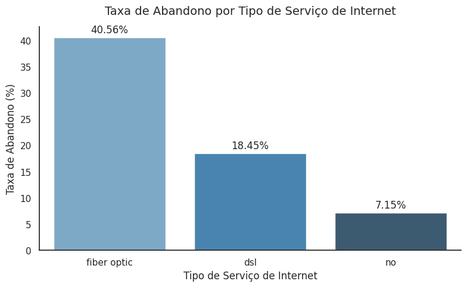
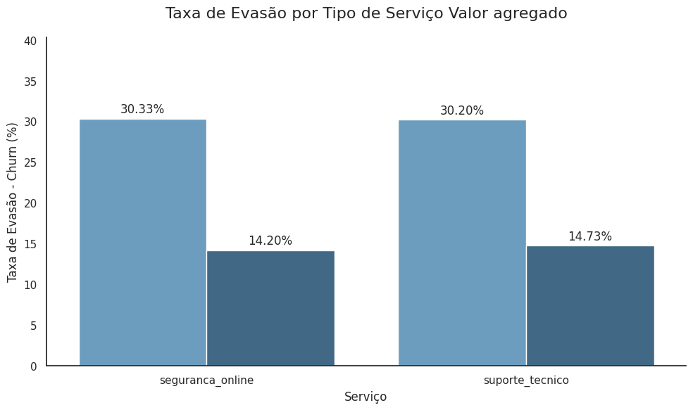
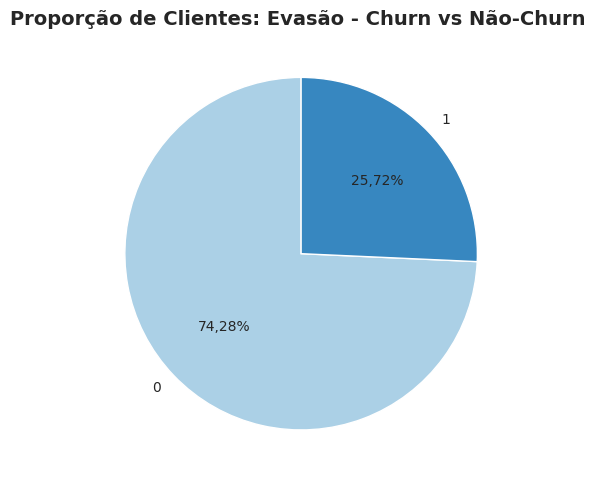

# 📞 Telecom X – Análise de Evasão de Clientes (Churn)

Este projeto apresenta uma análise exploratória dos dados de clientes da **Telecom X**, com foco na evasão de clientes (churn). O objetivo principal é identificar padrões e fatores associados ao cancelamento dos serviços, oferecendo insights valiosos que sirvam de base para decisões estratégicas de retenção de clientes.

---

## 🎯 Objetivo do Projeto

Investigar os fatores que influenciam a evasão de clientes, com base em dados cadastrais e comportamentais. A análise busca responder: **quais serviços, perfis e comportamentos estão mais associados ao cancelamento?**

---

## 🧾 Resumo da Análise

A análise foi conduzida com base em uma base de dados da Telecom X, contendo informações sobre o perfil do cliente, seus serviços contratados e status de cancelamento. Após o pré-processamento e tratamento de dados, foram geradas visualizações que permitiram identificar os fatores que mais contribuem para a evasão.

Os principais pontos abordados foram:

- **Distribuição da evasão (churn)** na base de clientes.
- **Relação entre tipo de serviço de internet e churn**.
- **Impacto da ausência de serviços adicionais**, como segurança online e suporte técnico.
- **Comportamento de churn por tipo de contrato e método de pagamento.**

Essas visualizações foram fundamentais para entender os padrões de cancelamento e fornecer recomendações para retenção.

---

## 📂 Estrutura do Projeto

```
02DSChalenge/
├── DS_Chl02_TelecomX_BR.ipynb            # Notebook com a análise completa
├── dados/                                # Diretório para armazenar os dados 
│   ├── TelecomX_Data.json
│   ├── TelecomX_dicionario.md 
├── graficos/                             # Gráficos salvos localmente
│   ├── clienteevasao.png
│   ├── TipoServico2.png
│   ├── TipoServicoAg.png
│   ├── MetodoPagamento.png
│   ├── evasaoTipocontrato.png
│   ├── DistribuicaoPerdas.png 
│   ├── ContratoTEmpo.png 
├── README.md                             # Documentação do projeto
```

---

## 📊 Exemplos de Gráficos e Insights


### 🔍 Taxa de Evasão por Tipo de Serviço de Internet
<p align="center">
  
  <br><em> Taxa de Abandono por Tipo de Serviço de Internet</em>
</p>
**Insight:**  
Clientes com serviços como **"Sem Internet"** apresentaram taxas de abandono significativamente mais altas, sugerindo que os serviços de internet contribuem para a fidelização.

### 🔐 Ausência de Segurança Online e Suporte Técnico
<p align="center">
  
  <br><em>Taxa de Evasão por Tipo de Serviço Valor Agregado</em>
</p>
**Insight:**  
Clientes **sem serviços de segurança online ou suporte técnico** estão muito mais propensos a abandonar a empresa, evidenciando a importância desses adicionais para reter clientes.

### 📈 Distribuição Geral do Churn

<p align="center">
  
  <br><em>Proporção de Evasão de Clientes Churn</em>
</p>

**Insight:**  
A taxa geral de churn foi considerada **alta**, indicando uma necessidade urgente de ações estratégicas de retenção.

---

## 🧠 Principais Conclusões

- A presença de **serviços adicionais** (segurança online, suporte técnico) reduz a chance de churn.
- Clientes com **internet por fibra** têm maior fidelização.
- Clientes com contratos mensais são mais propensos a abandonar o serviço.
- Métodos de pagamento eletrônicos estão associados a menor evasão.

---

## 🧰 Tecnologias Utilizadas

- Python 3.11+
- Pandas
- Matplotlib
- Seaborn
- Google Colab

---

## ▶️ Como Executar

1. Acesse o Google Colab ou Jupyter Notebook.
2. Carregue o arquivo `DS_Chl02_TelecomX_BR.ipynb`.
3. Execute as células sequencialmente.
4. Certifique-se de que a base de dados esteja disponível no mesmo diretório ou atualize o caminho dos dados no notebook.
5. Os gráficos e análises serão exibidos automaticamente.

---

## 🚀 Extensões Futuras

- Construção de um **modelo preditivo de churn** com algoritmos de machine learning.
- Desenvolvimento de **dashboards interativos** com ferramentas como `Plotly` ou `Power BI`.
- Integração com dados históricos de campanhas de retenção para avaliar efetividade.

---

## 🤝 Contribuições

Contribuições são bem-vindas! Sinta-se livre para:
- Abrir issues com sugestões ou bugs.
- Enviar pull requests com melhorias de visualização ou código.

---

## 📜 Licença

Este projeto é de uso acadêmico e está licenciado sob os termos da **MIT License**.

---

## 👩‍💻 Autora

**Marilene do Narciso do Nascimento Souza**  
Profissional em análise de dados e transformação digital na indústria farmacêutica e telecom.

---

> _"Transformar dados em decisões inteligentes é o verdadeiro diferencial competitivo."_
